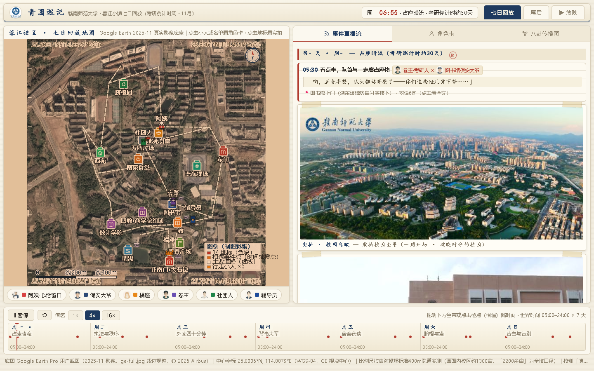
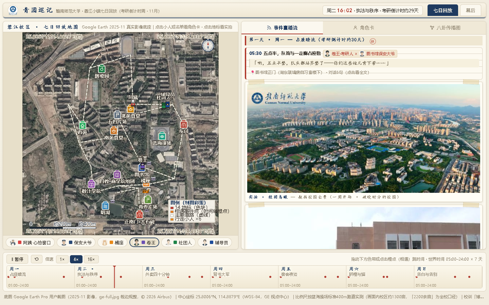
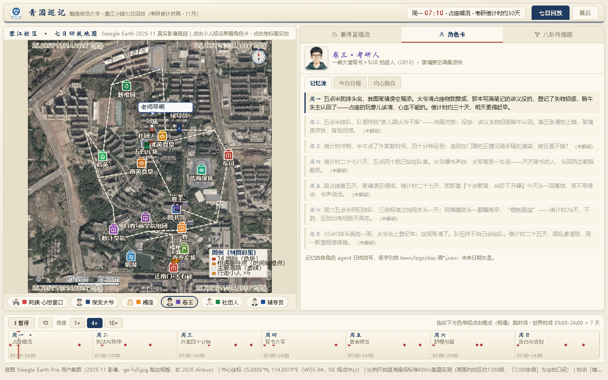
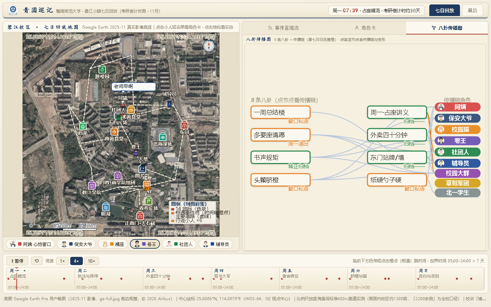
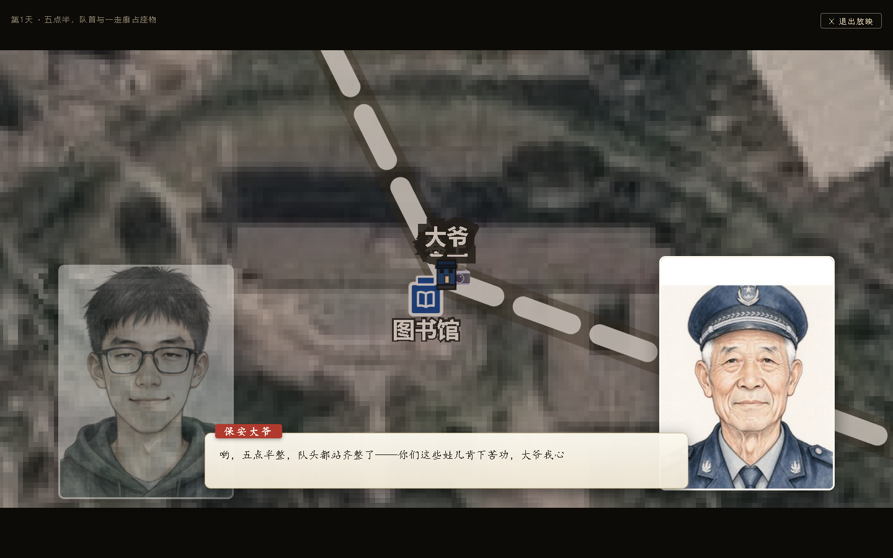

# 青园巡记 · Emergent Campus Chronicle

> 六名 AI 角色在我们的校园里生活了七天。没有剧本——这个故事，没有一个字出自人手。



## 这是什么

《青园巡记》是一个**单文件 HTML 交互回放页**：六名 AI 角色（食堂阿姨、图书馆保安大爷、校园猫·橘座、卷王·考研人、社团人、辅导员）在一所真实校园里度过了七天（考研倒计时周）。

- **涌现，而非编写**：导演智能体只排真实事件链（课表、作息），相遇对白由角色**互盲即兴**——彼此看不到对方的底稿；八卦靠 world-state 状态机自己传播、自己发酵
- **三关评审**：全部台词经"事实关 / 人设连续关 / 平淡度关"三道智能体评审逐句把关，评审记录可在页内「幕后」标签查验
- **真实底图**：地图取自 Google Earth 实测影像，14 个地标与官方分区图逐一对位，小人沿真实路网走动
- **影院模式**：一键自动放映——自动导演挑场、跟拍走位、推近拉出，对话以视觉小说式立绘特写呈现
- **断网可跑**：全部数据内嵌的单文件 HTML（1.7MB）

## 快速开始

双击 `青园巡记.html`（推荐 Chrome / Edge），或：

```bash
npx serve .
```

## 操作

| 操作 | 效果 |
|---|---|
| 拖动 / 播放 / 倍速 | 驱动七日时间轴，小人在地图上实时走动 |
| 点地图小人 / 右侧名单 | 打开角色卡：记忆流、独白、关系 |
| 🕸 八卦传播图 | 查看 8 条八卦如何一传十、十传百 |
| ▶ 放映 | 影院模式：自动导演+运镜+视觉小说对话（Esc 退出） |
| `?nocover=1` | 跳过开场卷宗封面 |

## 截图

| 事件直播流 | 角色卡 |
|---|---|
|  |  |
| **八卦传播图** | **影院模式 · 视觉小说对话** |
|  |  |

## 多智能体管线

```
导演 agent ──▶ 六名角色 agent（互盲即兴）──▶ 三关评审 agent
（排真实事件链）    （相遇对白/独白/动作）     （事实 · 人设连续 · 平淡度）
                                                        │
                              world-state 状态机 ◀─── 档案 agent
                              （八卦传播/关系/情绪）        （归档与召回）
```

七日主题弧线：占座暗流 → 执法与秩序 → 外卖四十分钟 → 背书大军 → 宿舍夜谈 → 脐橙与猫 → 告白与告别。

## 致谢

- Google Earth —— 校园底图影像
- [ZCode](https://zcode.ai) 多智能体集群 · 智谱 GLM —— 导演/角色/评审/档案全部智能体
